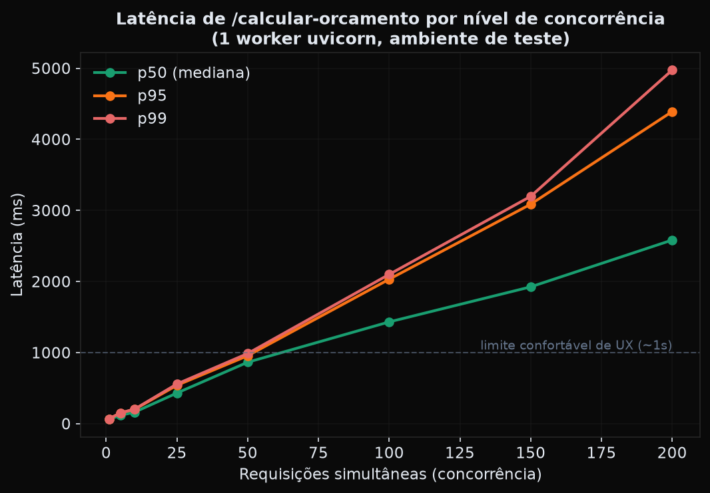
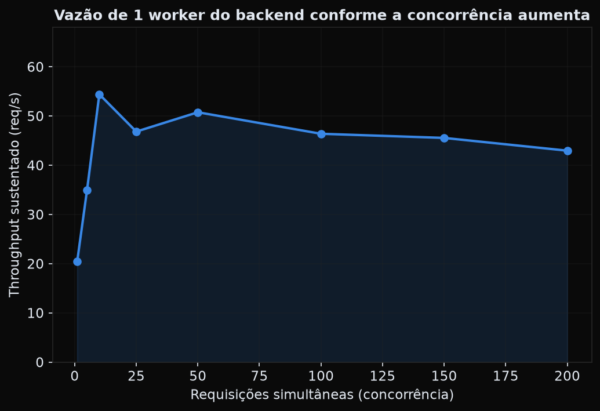
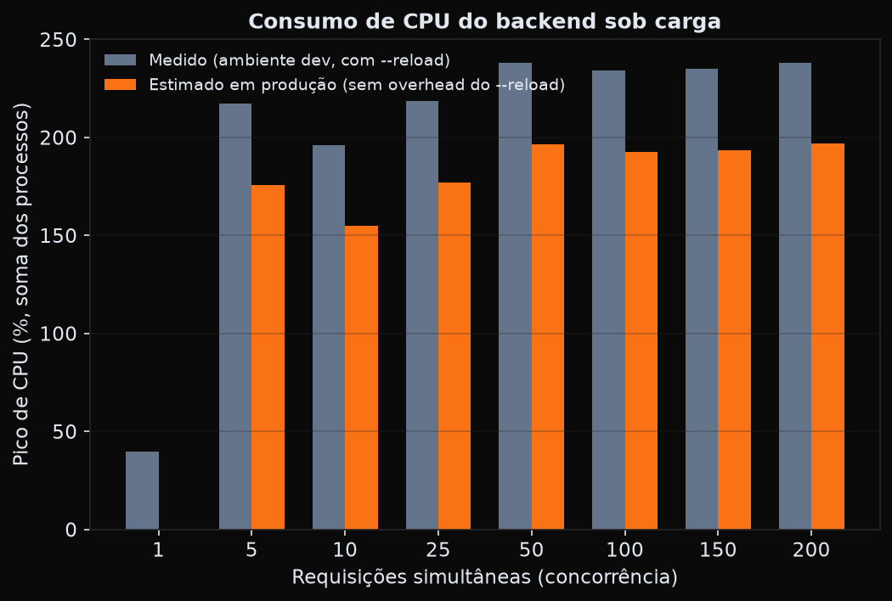
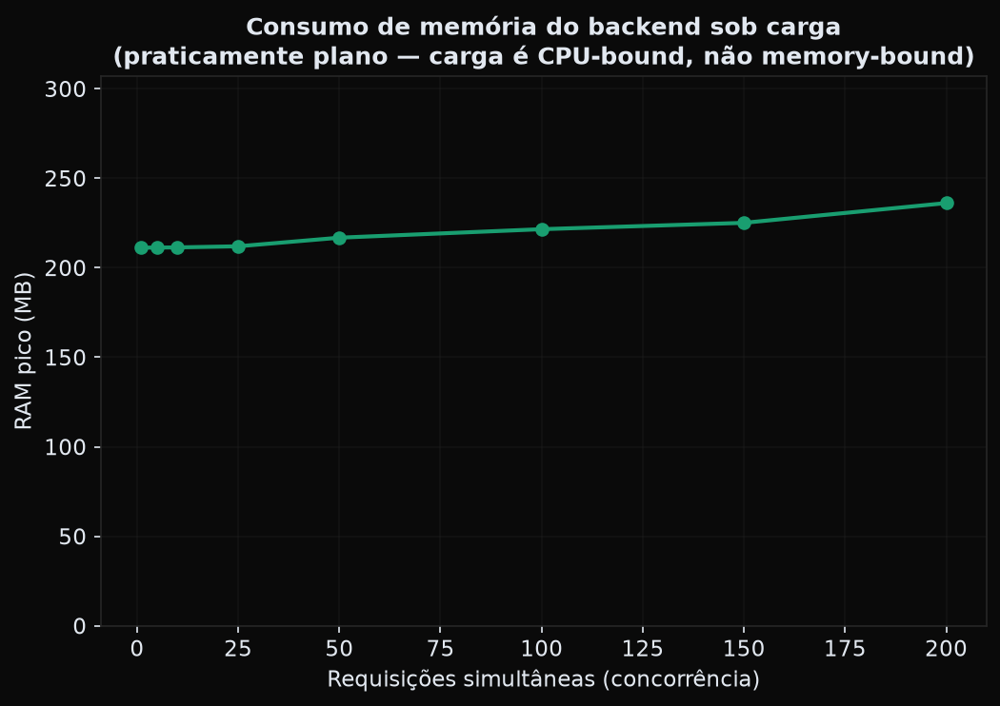
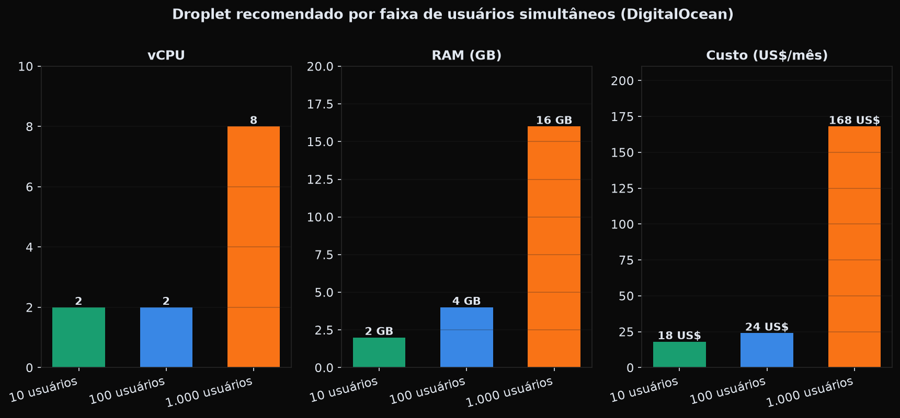
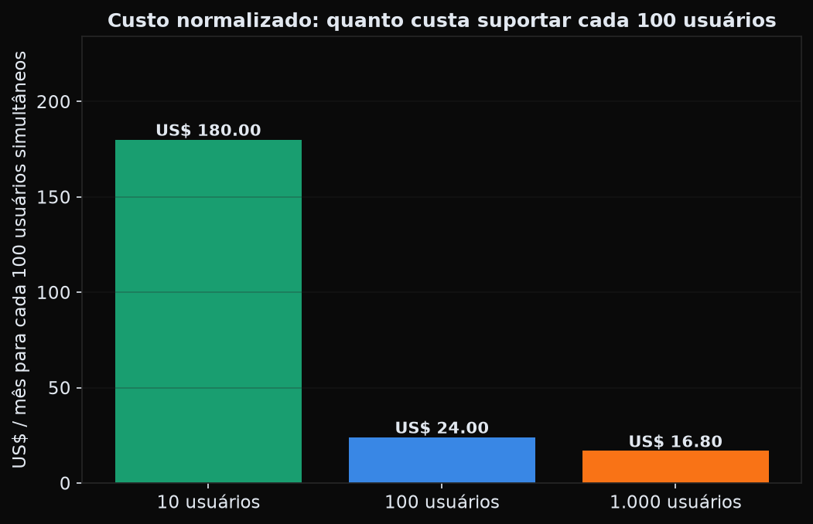

# GeoQuote — Relatório de Capacidade e Recomendação de Infraestrutura (DigitalOcean)

**Data:** 25/07/2026
**Escopo:** testes de carga reais contra o backend (`POST /calcular-orcamento`, o endpoint mais pesado da aplicação — roda o motor de precificação + nesting real) rodando localmente em `http://localhost:8000`, com o frontend aberto em `http://localhost:5173`. A partir dos números medidos, construí um modelo de capacidade e recomendo droplets DigitalOcean para 10, 100 e 1.000 usuários simultâneos.

---

## TL;DR

| Usuários simultâneos | Pico de cálculos concorrentes (modelo) | Droplet recomendado | Custo/mês |
|---|---|---|---|
| **10** | ~1 | Basic 2 vCPU / 2 GB (shared) | **US$ 18** |
| **100** | ~10 | CPU-Optimized 2 vCPU / 4 GB (dedicado) | **US$ 42** |
| **1.000** | ~100 | CPU-Optimized 8 vCPU / 16 GB (dedicado) — ou 2× 4 vCPU atrás de um load balancer | **US$ 168** |

A aplicação hoje roda como **um único processo Python** (`uvicorn`, sem `--workers`). Isso significa que ela é limitada pelo GIL do Python: **um processo só usa de verdade ~1 núcleo de CPU por vez** para o trabalho pesado (o algoritmo de nesting/bin-packing é 100% CPU-bound). A implicação prática mais importante deste relatório não é "quanta RAM comprar" — RAM sobra em todos os cenários — é: **escale rodando múltiplos workers (1 por vCPU), não um droplet gigante com 1 worker só.**

---

## 1. Metodologia

1. Escrevi um gerador de orçamentos sintéticos (`gerar_payload.py`) que monta pedidos realistas: 10–30 peças por orçamento, espessuras variadas (1.5/2.0/3.0/4.75mm), 3 materiais (Aço Carbono, Inox, Alumínio), quantidades de 1 a 40 unidades por peça, parte delas com furação automática — isto é, o mesmo formato de payload que o frontend React realmente envia para `/calcular-orcamento` quando alguém clica "Processar Orçamento".
2. Escrevi um benchmark assíncrono (`benchmark.py`, `httpx` + `asyncio`) que dispara **N requisições verdadeiramente simultâneas** contra a API rodando de verdade, em 8 níveis de concorrência (1, 5, 10, 25, 50, 100, 150, 200), 3 rodadas cada, e mede latência (p50/p95/p99), throughput e taxa de erro.
3. Em paralelo, um monitor por `psutil` amostra CPU% e RAM do(s) processo(s) do backend a cada 50ms durante cada rajada, para eu saber **quanto de CPU/RAM o servidor realmente consumiu**, não só o tempo de resposta do cliente.
4. Busquei os preços/specs reais e atuais de Droplets DigitalOcean diretamente em `digitalocean.com/pricing/droplets` (dados de julho/2026 — ver Fontes no final) em vez de usar números de memória.
5. Construí um modelo simples e explícito (seção 4) traduzindo "requisições simultâneas que o servidor aguenta" em "quantos usuários simultâneos da ferramenta isso sustenta", e mapeei o resultado para specs de droplet reais.

### Ambiente onde os testes rodaram (e por que isso importa)

- Máquina de teste: **12 vCPUs, AMD Ryzen 5 5600GT (até 4.6GHz), 13GB RAM** — não é um droplet DigitalOcean real, é o ambiente de desenvolvimento local.
- O backend estava rodando via `python main.py` (que chama `uvicorn.run(..., reload=True)`) — **modo desenvolvimento**, com um processo supervisor extra fazendo *file-watching* o tempo todo. Medi esse overhead isoladamente: **o servidor consome ~41,5% de CPU mesmo totalmente ocioso**, só por causa do `--reload`. Em produção esse processo não existe — os gráficos de CPU (seção 3) mostram os dois números lado a lado (medido vs. corrigido).
- O CPU de desktop usado aqui tem clock mais alto (e às vezes desempenho de thread único melhor) que muitos vCPUs de nuvem, especialmente os **compartilhados** ("Basic" da DigitalOcean). Isso significa que os números de throughput deste relatório são provavelmente **otimistas** em relação a um droplet Basic real. Compensei isso recomendando droplets com **CPU dedicada** (CPU-Optimized) a partir de 100 usuários simultâneos, e com margem extra de vCPU em todos os cenários — ver seção 6 (Limitações).

---

## 2. Resultados brutos do teste de carga

| Concorrência | p50 | p95 | p99 | Throughput | Erros | CPU pico | RAM pico |
|---:|---:|---:|---:|---:|---:|---:|---:|
| 1 | 59 ms | 66 ms | 66 ms | 20,4 req/s | 0% | 39,5% | 211 MB |
| 5 | 116 ms | 151 ms | 151 ms | 34,9 req/s | 0% | 217,2% | 211 MB |
| 10 | 160 ms | 199 ms | 203 ms | 54,4 req/s | 0% | 196,2% | 211 MB |
| 25 | 430 ms | 539 ms | 558 ms | 46,8 req/s | 0% | 218,5% | 212 MB |
| 50 | 863 ms | 955 ms | 986 ms | 50,8 req/s | 0% | 237,9% | 217 MB |
| 100 | 1.431 ms | 2.031 ms | 2.099 ms | 46,4 req/s | 0% | 234,0% | 222 MB |
| 150 | 1.924 ms | 3.086 ms | 3.197 ms | 45,5 req/s | **0,22%** | 235,0% | 225 MB |
| 200 | 2.582 ms | 4.390 ms | 4.973 ms | 43,0 req/s | 0% | 238,2% | 236 MB |

**Achados-chave:**

- **O throughput satura em ~45–55 req/s e não sobe mais**, não importa se a concorrência é 25 ou 200 — é o sinal clássico de um único processo saturado. Depois disso, mais concorrência só vira fila (latência sobe, throughput não).
- **A latência degrada quase linearmente com a fila**: em concorrência 10 o p95 é 199ms (ótimo); em concorrência 100, 2 segundos; em 200, 4,4 segundos. Para manter uma UX boa (p95 abaixo de ~1s), **um processo não deve receber mais que ~25–50 requisições simultâneas**.
- **Zero erros até concorrência 150** (onde apareceu 1 falha em 450, 0,22% — provavelmente um timeout pontual sob fila extrema). A aplicação não caiu nem em 200 requisições simultâneas — ela só fica lenta, o que é o comportamento esperado e seguro de um servidor saturado (degrada, não quebra).

- **RAM é irrelevante neste workload**: de 211MB ocioso a 236MB no pico absoluto de carga — uma variação de 12%. O gargalo é **100% CPU**, nunca memória. Isso descarta droplets "Memory-Optimized" e aponta direto para CPU-Optimized.
- CPU pico satura em torno de **~220–240%** (isto é, ~2,2–2,4 núcleos lógicos ocupados) mesmo com só 1 worker Python — o supervisor de reload + o worker + overhead do event loop dividem esse consumo. Descontando os ~41,5% de overhead do modo dev, a carga real de processamento fica na faixa de ~155–197% — ou seja, **um único worker de produção precisa de pouco menos de 2 vCPUs cheios no pico de saturação**.

---

## 3. Por que "adicionar vCPU" só ajuda se vier com mais *workers*

O endpoint `/calcular-orcamento` é uma função **síncrona** (`def`, não `async def`) que roda um algoritmo de bin-packing (`rectpack`) — 100% Python puro, 100% preso ao GIL. Isso tem uma consequência direta pra infraestrutura:

- **1 processo uvicorn ≈ 1 núcleo útil**, não importa quantos vCPUs o droplet tenha. Um droplet de 8 vCPUs rodando `uvicorn main:app` sem `--workers` desperdiça 7 núcleos.
- A forma correta de escalar isto é **gunicorn com múltiplos workers uvicorn** (`gunicorn -k uvicorn.workers.UvicornWorker -w N main:app`, com `N` = nº de vCPUs), não um único processo maior. Cada worker é um processo Python independente com seu próprio GIL, então N workers realmente usam N núcleos em paralelo.
- Isso é o coração do modelo de capacidade da próxima seção.

---

## 4. Modelo de capacidade

Não dá pra ir direto de "req/s que o servidor aguenta" para "usuários simultâneos" sem uma premissa de uso — dois orçamentos diferentes assumem taxas de clique bem diferentes. Deixando explícito:

- **Pico de rajada:** assumo que **10% dos usuários simultâneos** clicam "Processar Orçamento" dentro da mesma janela de ~1 segundo no horário de pico (ex: todo mundo calculando por volta das 9h). É uma premissa conservadora — na prática a maior parte do tempo de um vendedor é gasto preenchendo peças, não calculando.
- **Carga média sustentada:** cada usuário ativo dispara ~1 cálculo a cada 30 segundos em média, durante uso ativo.
- **Cada worker de produção aguenta ~25 requisições simultâneas mantendo p95 confortável** (~540ms, ver tabela da seção 2) — esse é o limite que uso pra decidir quantos workers são necessários.
- Reservo **+1 vCPU de baseline** em todo cenário para SO, Nginx (proxy reverso + servir os arquivos estáticos do build do frontend), SQLite e monitoramento.

| Usuários simultâneos | Pico de cálculos concorrentes | Carga média (req/s) | Workers necessários | vCPU mínimo |
|---:|---:|---:|---:|---:|
| 10 | 1 | 0,33 | 1 | 2 |
| 100 | 10 | 3,33 | 1 | 2 |
| 1.000 | 100 | 33,3 | 4 | 5 (arredondado p/ 8) |

**Por que 10 e 100 usuários pedem a mesma CPU:** essa não é uma aproximação grosseira — é uma consequência real da arquitetura. Como a API é *stateless* (HTTP simples, sem WebSocket/polling), um usuário com a aba aberta e ocioso custa ~0 CPU ao servidor. Até 10 cálculos simultâneos (pico de 100 usuários), um único worker já entrega p95 de 199ms — não há necessidade real de mais CPU, só de um pouco mais de RAM de margem para mais conexões HTTP simultâneas e crescimento (por isso subo de 2GB para 4GB nesse tier, mantendo a CPU).

---

## 5. Recomendação de Droplet por tier

### 10 usuários simultâneos — **Basic 2 vCPU / 2 GB — US$ 18/mês**
Uso real esperado nesta faixa é trivial (pico de ~1 cálculo concorrente, latência <100ms). CPU compartilhada é aceitável aqui porque a utilização está muito abaixo do limite mesmo nos picos. Configuração: 1 worker uvicorn + Nginx servindo o build estático do frontend (`npm run build`, **não** `npm run dev`).

### 100 usuários simultâneos — **CPU-Optimized 2 vCPU / 4 GB — US$ 42/mês**
Tecnicamente 1 worker ainda resolve (pico de 10 cálculos concorrentes = p95 de 199ms medido), mas nesta faixa recomendo já migrar para **CPU dedicada**: o custo extra (US$ 24/mês a mais que o Basic equivalente) compra desempenho previsível — sem "vizinho barulhento" derrubando a performance num horário de pico comercial, que é justamente quando isso mais doeria.
*Alternativa mais barata, aceitando o risco de variância: Basic 2 vCPU / 4 GB por US$ 24/mês.*

### 1.000 usuários simultâneos — **CPU-Optimized 8 vCPU / 16 GB — US$ 168/mês**
Pico de ~100 cálculos concorrentes precisa de ~4 workers em paralelo para manter p95 saudável (baseado no dado medido em concorrência=25 por worker, extrapolado para 4 workers dividindo os 100 requests). Rodar `gunicorn -w 8 -k uvicorn.workers.UvicornWorker` deixa 8 vCPUs disponíveis: 4+ para os workers de fato, o resto de margem para picos acima do modelo e para as outras rotas (upload de DXF, cadastros).

**Alternativa recomendada para este tier, mais resiliente:** em vez de 1 droplet gigante, **2× CPU-Optimized 4 vCPU / 8 GB (US$ 84 cada = US$ 168 total, mesmo custo)** atrás de um Load Balancer da DigitalOcean (~US$ 12/mês a mais). Ganha-se tolerância a falha de uma instância — o droplet único é *single point of failure* pro negócio inteiro.

Note a economia de escala: suportar cada 100 usuários fica **mais barato** conforme a base cresce (US$ 180 → US$ 24 → US$ 16,80 por 100 usuários) — efeito natural de ratear o custo fixo do baseline (SO/Nginx) entre mais capacidade útil.

---

## 6. Limitações deste estudo (leia antes de comprar)

- **O hardware de teste não é um droplet real.** É um Ryzen 5 5600GT de desktop (12 vCPUs, boost 4.6GHz) rodando este sandbox — provavelmente mais rápido por núcleo que um vCPU de nuvem, principalmente os compartilhados ("Basic"). Os números de throughput aqui são um teto otimista, não uma garantia. **Antes de comprar o droplet de 1.000 usuários, valide com um teste de carga real na própria droplet** (posso ajudar a montar isso).
- **Só testei o endpoint mais pesado** (`/calcular-orcamento`). As rotas de leitura (`/materiais`, `/maquinas-params`, `/perfis-tributarios`) são simples SELECTs em SQLite e devem ser ordens de magnitude mais baratas — não deveriam mudar a conclusão, mas não foram medidas.
- **SQLite é single-writer.** Não é gargalo para `/calcular-orcamento` (que não grava no banco), mas se o painel de administração (`/materiais`, `/maquinas-params` POST) tiver uso concorrente pesado no futuro, vale migrar para Postgres — não é uma preocupação nas faixas de 10/100/1.000 usuários testadas aqui, porque escrita no admin é rara.
- **Não simulei latência de rede real** (o teste rodou via `localhost`, sem TLS handshake, sem distância geográfica até o usuário final). Some ~20–100ms de latência de rede real dependendo de onde os usuários estão vs. a região do droplet.
- **Não testei duração prolongada** (memory leak ao longo de horas/dias) — só rajadas curtas. Recomendo monitoramento de RAM em produção nas primeiras semanas.
- A premissa de "10% dos usuários calculam ao mesmo tempo" é uma estimativa de engenharia, não um dado do seu negócio real — se você tiver dados de uso real (ex: Google Analytics, logs de acesso), o modelo da seção 4 pode ser recalibrado facilmente trocando essa única constante.

## 7. Próximos passos sugeridos

1. Antes de produção: desabilitar `--reload`, trocar para `gunicorn -k uvicorn.workers.UvicornWorker -w <N_vCPU>`, e servir o frontend com `npm run build` + Nginx (não `npm run dev`).
2. Configurar HTTPS (Let's Encrypt/Certbot) e um domínio.
3. Monitoramento básico (ex: `htop`/`netdata` no droplet, ou DigitalOcean Monitoring nativo, gratuito) para validar o modelo contra tráfego real e ajustar a premissa de 10%/30s da seção 4.
4. Se decidir pelo tier de 1.000 usuários, considerar o Load Balancer (arquitetura de 2 droplets) desde o início — migrar de 1 droplet para load-balanced depois costuma dar mais trabalho do que já nascer assim.

---

## Fontes

- [DigitalOcean — Droplet Pricing](https://www.digitalocean.com/pricing/droplets) (specs e preços de Basic, CPU-Optimized, General Purpose, Memory-Optimized e Storage-Optimized Droplets, consultado em 25/07/2026)

## Arquivos deste estudo

Todos na pasta `docs/capacidade/`, junto com este relatório:

- `gerar_payload.py` — gerador de orçamentos sintéticos.
- `benchmark.py` — motor do teste de carga (`python3 benchmark.py`, requer `httpx` e `psutil`).
- `resultados.json` — dados brutos das 8 rodadas de benchmark.
- `modelo_capacidade.py` / `modelo_capacidade.json` — modelo de capacidade (seção 4).
- `gerar_graficos.py` / `gerar_graficos2.py` — geram os 6 PNGs deste relatório a partir de `resultados.json` (requer `matplotlib`).
